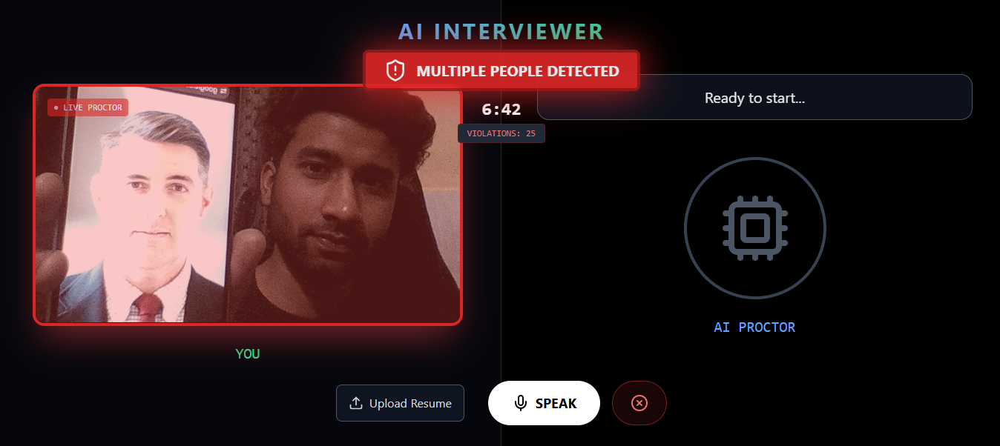
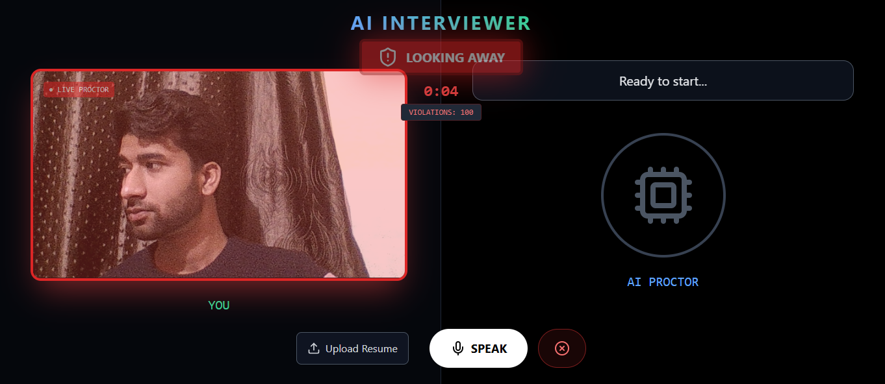
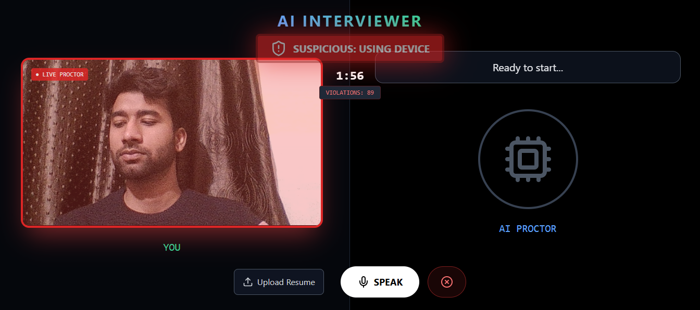
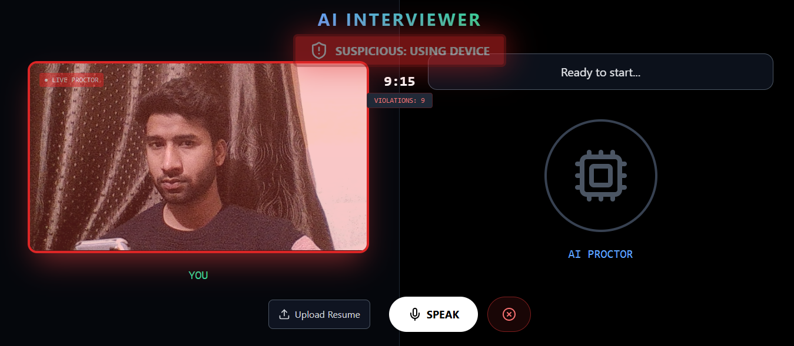

# 🤖 AI Smart Interviewer & Proctor

A full-stack AI-powered interviewing platform that conducts technical interviews based on uploaded resumes while monitoring the candidate for malpractice using Real-Time Computer Vision.


## 📸 Proctoring In Action

The AI monitors the video feed frame-by-frame on the client-side to detect malpractice.

| **🚫 No Face Detected** | **👥 Multiple People Detected** |
|:-------------------:|:---------------------------:|
|  |  |
| **👀 Looking Away (Gaze Tracking)** | **📱 Suspicious Device Usage** |
|  |  |
| **MObile Use** |
|  |

## 🚀 Features

- **Context-Aware Interviewing:** Parses PDF resumes and generates specific technical questions using **Llama-3 (Groq)**.
- **Real-Time Voice AI:** Full-duplex voice conversation with <500ms latency using **Deepgram** (STT) and **EdgeTTS**.
- **AI Proctoring System:** Browser-based anti-cheating system using **Google MediaPipe**. Detects:
  - No Face / Multiple Faces
  - Suspicious Gaze (Looking away)
  - Device Usage (Head tilt + Gaze tracking)
- **Violation Reporting:** Generates a scorecard with total violation counts at the end.

## 🛠️ Tech Stack

| Component | Technology |
|-----------|------------|
| **Frontend** | React.js, Tailwind CSS, Lucide React |
| **AI Vision** | Google MediaPipe (Face Landmarker) |
| **Backend** | Python FastAPI, WebSockets |
| **LLM Engine** | Llama-3-8b (Groq API) |
| **Speech API** | Deepgram Nova-2 (STT), Edge-TTS (TTS) |

---
## 📖 Usage Guide

1. **Upload Resume:** Click the "Upload" button and select a PDF resume.
2. **Start Camera:** Click "Start Camera ". Allow browser permissions.
3. **The Interview:**
   * The AI will introduce itself and ask a question based on your resume.
   * **Speak Answer:** Click "Speak", answer the question, then click "Stop".
   * The AI will process your answer and ask the next question.
4. **Proctoring:** Try looking away or covering your face to see the **Anti-Cheating System** trigger warnings.
5. **End Session:** Click "End Interview" to see your **Violation Scorecard**.

---

## 🧠 Engineering Highlights

* **Solved Latency:** Replaced standard HTTP requests with **WebSockets** for audio streaming, reducing conversation lag from ~3 seconds to **under 500ms**.
* **Edge AI Implementation:** Implemented the computer vision logic on the **Frontend (Browser)** instead of the Backend. This eliminates video upload bandwidth costs and privacy concerns.
* **Context Management:** Designed a prompt engineering system that maintains conversation history, allowing the AI to ask follow-up questions logically.

---

## 📂 Project Structure

```bash
ai-interview-proctor/
├── backend/                 # Python FastAPI Server
│   ├── app.py               # WebSocket Entry Point
│   ├── interviewer.py       # Llama-3 Logic & Context Management
│   ├── audio_handler.py     # STT (Deepgram) & TTS (Edge)
│   └── requirements.txt     # Python Dependencies
│
├── frontend/                # React Vite Application
│   ├── src/
│   │   ├── App.jsx          # Main UI & Proctoring Logic
│   │   ├── main.jsx         # React Entry
│   │   └── index.css        # Tailwind Global Styles
│   ├── public/              # Static Assets
│   └── package.json         # Node Dependencies
│
└── README.md                # Documentation
```
---

## 🔮 Future Roadmap

- [ ] **Authentication:** Add User Login/Signup using Firebase or Auth0.
- [ ] **Database Integration:** Save interview transcripts and violation reports in MongoDB/PostgreSQL.
- [ ] **Question Bank:** Allow interviewers to select specific topics (e.g., React, Java, System Design).
- [ ] **Emotion Analysis:** Use AI to detect candidate confidence levels based on voice tonality.
- [ ] **Report Email:** Automatically email the violation scorecard PDF to the HR/Recruiter.


## 👨‍💻 Author
**Ravi Gupta** *Full Stack Developer & AI Enthusiast*

- 🌐 [LinkedIn](https://www.linkedin.com/in/ravi07gupta)  
- 🐙 [GitHub](https://github.com/Ravigupta9968)
---
